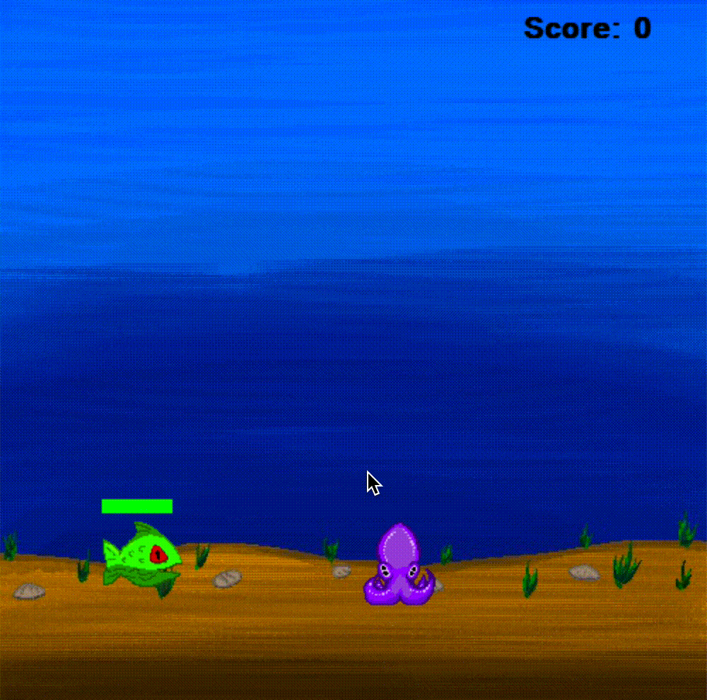
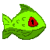

# Squiddy!
### A simple platformer and my introduction to programming
During the pandemic I realized I could design pixel art on my iPad. With all the free time, I got to making little 
animations and gifs, which spitballed into me trying to incorporate those assets into a little mini-game. Behold Squiddy,
a platformer where you shoot bubbles at "evil" fish that try and attack you! Fully equipped with music and sound effects!

---
### Gameplay

---
### Pixel art assets

